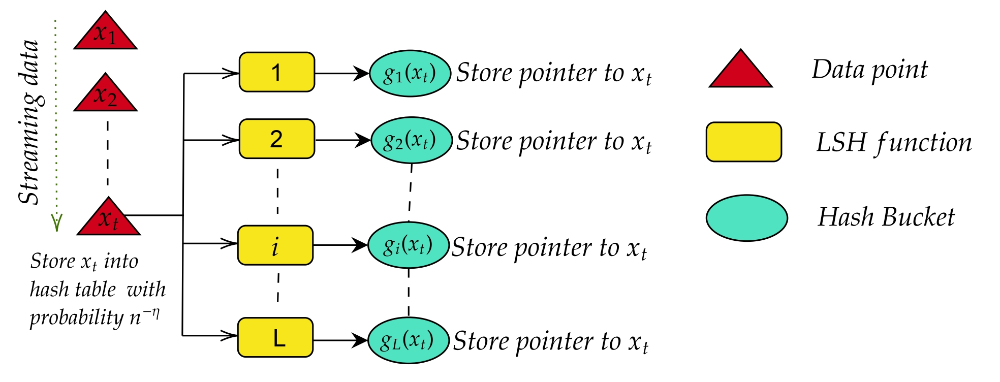
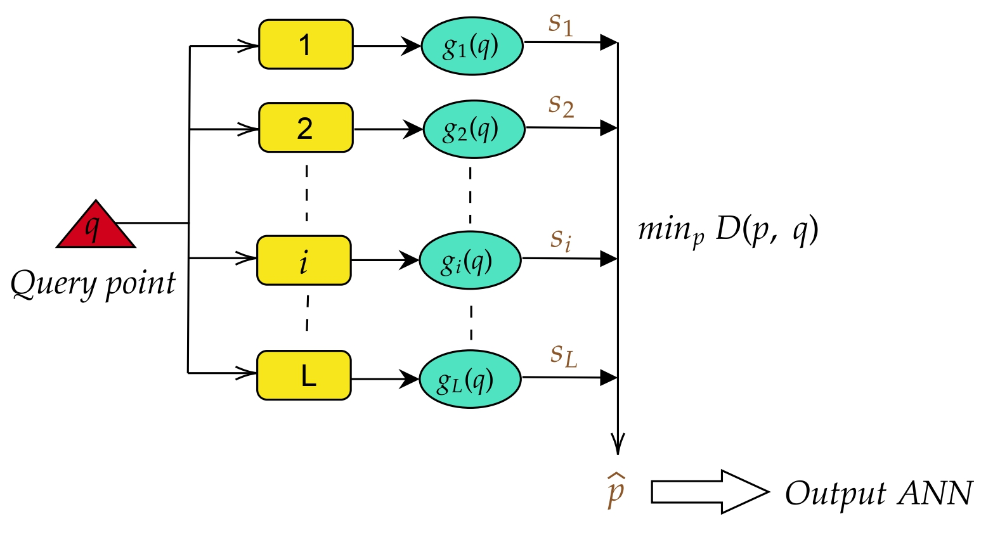

# Streaming ANN and AKDE
This repository contains the code of the proposed `ANN` and `AKDE` algorithms.

## Run the codes
The codes for AKDE are present in `Code/SlidingWindowKDE`, whereas those of ANN are in `Code/StreamingANN`.

## AKDE
The code is tested on Linux platform using Python 3.12.0. The required Python libraries for running the code are as follows:
* numpy
* matplotlib
* tqdm
* torch
* scipy

Change the current directory to `/Code/SlidingWindowKDE/`. The different steps of the `SW-AKDE` algorithm are illustrated in Figs. 1 and 2.

<p align="center">
  
  <br>
  <em>Figure 1: SW-AKDE update mechanism. </em>
</p>
<p align="center">
  
  <br>
  <em>Figure 2: SW-AKDE query mechanism. </em>
</p>

First of all, you need to generate the datasets. 

* **Synthetic data:** To generate synthetic data, run
  ```
  python data_generate.py
  ```
  The generated data will be saved as *data_1.npy,data_2.npy,...,dat_50.npy* in the directory `/synthetic_data`. We have generated 50 datasets of size 10000 each, consisting of 200-dimensional vectors. We will use these data for Monte Carlo simulations to demonstrate the performance of our algorithm.
* **Real world data:**
  * For the `News headlines` data, we have generated the encodings as 384-dimensional vectors and saved them as `.npy` files in `/data`.
  * For the `ROSIS Hyperspectral Images`, we have the image and binary mask saved as `data/hsi.npy` and `data/hsi_gt.npy` respectively. Run `hsi_data_gen.py` for preprocessing the data. The preprocessed HSI data will be stored as `data/hsi_data_points.npy`.


Now we will enumerate the files for data structures and the algorithm implementation.


**Utilities:** The necessary data structures for the `AKDE` algorithm are implemented in the files `angular_hash.py`, `p_stable.py`, `buckets_DS.py`, `Exponential_Histogram.py`. The **AKDE** algorithm is implemented in:
* `Ang_hash_AKDE.py`: using angular kernel.
* `L2_hash_AKDE.py`: using Euclidean p-stable(p=2) kernel.

The implementation of `RACE` algorithm by *Coleman & Shrivastava* is given in `RACE_19.py`. Let us list out the procedure to conduct the three sets of experiments.
### Variation of mean relative error with sketch size
* **Real-world dataset** Run the following command in terminal to compute the log of mean relative errors for different sketch sizes corresponding to number of rows=100,200,400,800,1600,3200. We take the window size as 450.
  ```
  python3 sketch_size.py --file_name text --n 10000 --n_query 1000 --lsh 1 --b 1 --eps 0.1
  ```
  Explanations for options:
    * `file_name`: specifies the type of real-world dataset, text for **News headlines** or image for **ROSIS HSI**.
    * `n`: specifies number of streaming data (taken as 10000).
    * `n_query`: number of queries (taken as 1000).
    * `lsh`: specifies the type of LSH kernel, 1 for Angular and 2 for Euclidean.
    * `w`: specifies the width of the euclidean kernel.
    * `r`: specifies the range of the euclidean hash.
    * `b`: specifies the bandwidth of the hash function (taken as 1).
    * `eps`: relative error of the exponential histogram (taken as 0.1).
  
  For the aforesaid choice of dataset(text) and LSH(Angular) the error values and sketch sizes are saved in *error_vs_sz_text_Angular.txt*. We can get the plot by calling the utility function `graph_plotter.py` using appropriate parameters.

* **Synthetic dataset**
  We use the same setting as the real-world dataset. Run the command:
  ```
    python simulate_AH.py --lsh 2 --w 4 --r 1000 --b 1 --eps 0.1
  ```
  For each dataset *data_i.py*, the mean relative errors and sketch size are saved as *err_values_i.npy* and *sketch_sizes_i.npy* respectively in `Synthetic_data_outputs_L2` directory if we use euclidean LSH like in the foregoing command. For Angular hash, the outputs are saved in `Synthetic_data_outputs` directory. To plot the graphs for both Angular and Euclidean LSH, run the command
  ```
    python MC_plot_sketchsize.py
  ```
  The plots are saved as *MC_AH.pdf* in `Synthetic_data_outputs` directory and *MC_L2.pdf* in `Synthetic_data_outputs_L2` directory.
### Effect of window size on the mean relative error
Run the following command to plot the log of mean relative errors versus the number of rows for different values of window sizes (64,128,256,512,1024,2048). We have used L2 hash for the text data and Angular hash for the image data.
```
python window_size.py --file_name text --n 10000 --n_query 1000 --lsh 2 --w 4 --r 1000 --b 1 --eps 0.1
```
The options have the same explanation as before. The plot is saved as `Window_variation_text.pdf` in the `Outputs` directory.

### Comparison of AKDE with RACE
* **Real-world dataset** Run the following command to plot the performance of our algorithm **AKDE** with **RACE**. Note that AKDE works in the sliding window model(window size taken as 260) whereas RACE works in the general streaming setup. We have used *Angular LSH* for both the algorithms.
  ```
  python compare2.py --data_type text --n 10000 --n_query 1000 --b 1 --eps 0.1
  ```
  The option `data_type` specifies the type of dataset, text or image. The plot is saved as `mean_relative_error_vs_rows.pdf` in the `Outputs` directory.
* **Synthetic dataset**  Run the following command for synthetic dataset. Here, we have used Angular Hash and a window size of 260.
  ```
  python mc_compare.py --b 1 --eps 0.1
  ```
  Here, the options have the same explanation as before. The relative errors for RACE and AKDE are saved in *results_i.npy* for *i=1,2...,50* in `Synthetic_data_outputs_L2` directory. To plot the graph, run
  ```
  python mc_plot_compare.py
  ```
  The plot will be saved as `MC_compare.pdf` in `Synthetic_data_outputs` directory.

## Streaming ANN

The code is tested on Linux platform using Python 3.10.12. The required Python libraries for running the code are as follows:
* numpy
* matplotlib
* tqdm
* torch
* scipy
* pandas
* faiss

Change the current directory to /Code/StreamingANN/.
The different steps of the Streaming-ANN algorithm are illustrated in Figs. 3 and 4.

<p align="center">
   
  <br> 
  <em>Figure 3: S-ANN insert mechanism. </em> 
</p>
<p align="center"> 
  
  <br> 
  <em>Figure 4: S-ANN query mechanism. </em>
</p>

We used 3 datasets in order to demonstrate the performance of our algorithm. The ready to run csv versions of the datasets are stored in `/data_csvs`, while the raw files are stored in `/data`. 

* **Synthetic data:** To generate synthetic data, provide appropriate arguments and run  
  ```
  python data/datagen.py
  ```
  The generated data will be saved as *points.csv* in the same directory. 
* **Real world data:**
  * For the `sift1m` data, we obtained the raw 128-dimensional vectors, processed them and stored them in `\data_csvs`.
  * For the `fashion-mnist`, we obtained the raw 784-dimensional vectors, processed them and stored them in `\data_csvs`.

(Note: We have left these out of the repository because of large file size, you can easily find these standard datasets online)

Now we will enumerate the files for data structures and the algorithm implementation.

**Utilities:** 
The main algorithmic components of Streaming-ANN and the baseline are implemented in the files `src/StreamingANN.py` and `src/JL_baseline.py`.
* src/StreamingANN.py: the proposed streaming ANN algorithm.
* src/JL_baseline.py: Johnson–Lindenstrauss baseline for comparison.

All experimental configurations and plotting utilities are organized into three main sets of experiments, as described below.

### Experiment 1: Memory vs Recall

In order to setup the experiment, copy the `StreamingANN.py` and `JL_baseline.py` files from `/src` into the `/experiment1` directory. 
Run the following command in the terminal to compute the recall for varying memory sizes (compression ratios) for both the proposed S-ANN algorithm.

```
bash mem_vs_recall.sh
```

Run the following command in the terminal to compute the recall for varying memory sizes (compression ratios) for both the baseline JL algorithm.

```
bash jl_mem_vs_recall.sh
```

These respectively, will execute the following files:
```
experiment1/jl_memory_vs_recall.py

experiment1/mem_vs_recall.py
```

For more flexibility in setting the parameters of the experiments, you can use the following options: 
| **Option** | **Description** | **Default** | **Applies To** |
|-------------|-----------------|--------------|----------------|
| `--files <path>` | Input CSV file (e.g., `data_csvs/fashion_mnist.csv`) | `data_csvs/points.csv` | Both |
| `--epsilons <list>` | Comma-separated epsilon values controlling compression/distortion | `0.5,0.6,0.7,0.8,0.9,1.0` | S-ANN |
| `--c_values <list>` | Comma-separated c values controlling compression factor | `1.5,1.6,1.7,1.8,1.9, 2.0` | JL |
| `--etas <list>` | Comma-separated η (eta) values controlling sampling rate | `0.1,0.2,0.3,0.4,0.5,0.7,0.9` | S-ANN |
| `--k_values <list>` | Comma-separated reduced dimensions (k) for JL projection | `2,4,8,16,32,64,128` | JL |
| `--r_values <list>` | Comma-separated r values for (c,r)-ANN radius | `0.5,1` | S-ANN |
| `--r <float>` | Radius parameter | `0.5` | JL only |
| `--k <int>` | Recall Parameter | `50` | Both |
| `--n <int>` | Number of data points used for insertion | `50000` | Both |
| `--n_insert <int>` | Number of insertions | `50000` | Both |
| `--n_queries <int>` | Number of query points | `5000` | Both |
| `--d <int>` | Dimensionality of the data | `32` | Both |
| `--logdir <path>` | Directory to store logs | `logs/default_run` (S-ANN) / `logs/jl_default` (JL) | Both |
| `--results <path>` | Output results CSV | `results/mem_vs_recall_default.csv` (S-ANN) / `results/jl_results_default.csv` (JL) | Both |
| `--max_parallel <int>` | Maximum number of parallel jobs to run | `4` | Both |

The logs are stored in `/logs` in a separate subdirectory and the results are compiled and stored in a csv file in `/results`. 

We use `plot/median_difference_plot.py` and `plot/two_eps_plot.py` to generate the plots from the paper. First, copy the reults files generated from above into the same directory as the plotting script. Then follow the instructions given below.  

`plot/median_difference_plot.py` generates the summary difference plot (median difference vs ε) comparing StreamingANN and JL baseline. To generate the plot run the following command : 
```
python summary_difference_plot.py \
    --jl_csv results/final_jl_fm.csv \
    --sann_csv results/final_sann_fm.csv \
    --dim 64 \
    --n_points 50000 \
    --out figures/summary_difference_fm.pdf
```

Options:
  * `jl_csv` : specifies the results obtained on running `jl_mem_vs_recall.sh`
  * `sann_csv` : specifies the results obtained on running `mem_vs_recall.sh`
  * `dim` : specifies the dimension of the data used
  * `n_points` : specifies the number of points that were inserted into the data structure
  * `out` : specifies the output file

`plot/two_eps_plot.py` generates a comparison between the schemes for 2 epsilon values to show how our scheme outperforms the baseline for higher values of epsilon. To generate the plots run the following command: 
```
python plot_two_eps.py \
    --jl_csv results/final_jl_fm.csv \
    --sann_csv results/final_sann_fm.csv \
    --dim 64 \
    --n_points 50000 \
    --epsilons 0.5,0.9 \
    --outdir plots
```
Options:
  * `jl_csv` : specifies the results obtained on running `jl_mem_vs_recall.sh`
  * `sann_csv` : specifies the results obtained on running `mem_vs_recall.sh`
  * `dim` : specifies the dimension of the data used
  * `n_points` : specifies the number of points that were inserted into the data structure
  * `epsilons` : specifies the two values of epsilon used to plot the figures
  * `outdir` : specifies the output directory

### Experiment 2: Memory Variation Analysis


This script runs the Streaming-ANN algorithm for different dataset sizes, compression parameters, and ε/η values to analyze how the parameters affect sketch size. In order to run the experiment, copy `src/StreamingANN.py`, `src/JL_baseline.py` into this directory run:

```
bash experiment3/mem_variation.sh \
  --files data_csvs/points.csv \
  --epsilons 0.5 \
  --etas 0.2,0.3,0.4,0.5 \
  --r_values 1 \
  --N_values 64000,96000,128000,160000 \
  --K 50 \
  --d 128 \
  --n_queries 100 \
  --logdir logs/test \
  --results results/test.csv \
  --max_parallel 4
```
The options for the script are described below: 

| Option | Description | Default |
|--------|-------------|---------|
| `--files <path>` | Input CSV file(s) | `data/sift_base.fvecs` |
| `--epsilons <list>` | Comma-separated ε values for Streaming-ANN | `0.5` |
| `--etas <list>` | Comma-separated η values for Streaming-ANN | `0.2,0.3,0.4,0.5,0.6,0.7,0.8` |
| `--r_values <list>` | Comma-separated radius r values | `1` |
| `--N_values <list>` | Comma-separated dataset sizes to test | `64000,96000,128000,160000` |
| `--K <int>` | Number of neighbors | `50` |
| `--d <int>` | Dimension of dataset | `128` |
| `--n_queries <int>` | Number of queries per run | `1` |
| `--logdir <path>` | Directory to store logs | `logs/sann_mem_variation` |
| `--results <path>` | Output CSV file for results | `results_mem_variation.csv` |
| `--max_parallel <int>` | Maximum concurrent jobs | `4` |


This script computes and logs all results in:
```
results/results_mem_variation.csv
```

In order to plot the figure, one can use `plot/mem_variation_plot.py`. Simply copy the results csv into the same directory as the script as before and run:
```

```
python mem_variation_plot.py --csv results_mem_variation.csv --dim 128 --outdir plots
```
The options for the script are as follows : 
  * `csv`: Path to the results CSV file generated from the memory variation experiment
  * `dim`: Dimensionality of the dataset (used for the linear memory reference)
  * `outdir` : Directory where plots will be saved


### Experiment 3: QPS vs Recall

This experiment tests the query throughput of our scheme relative to its accuracy against the baseline. In order to run the script, in a similar manner to before, copy the contents of `src` into the `experiment3` directory and run the following command:
```
bash qps_script.sh # to run the script with the default parameters
```
Or alternatively, provide custom values for the 6 main parameters as so:
```
bash qps_script.sh 10000 100 0.5 qps_log.txt qps_results.csv 4
```
The options for this scipt are :

| Option         | Description                                                                        | Default Value     |
| -------------- | ---------------------------------------------------------------------------------- | ----------------- |
| `N_POINTS`     | Total number of points in the dataset                                              | 10000             |
| `N_QUERIES`    | Number of query points to evaluate                                                 | 100               |
| `EPSILON`      | Approximation parameter for JL and ANN                                             | 0.5               |
| `LOG_FILE`     | File to store detailed logs of each experiment                                     | `qps_log.txt`     |
| `RESULTS_FILE` | CSV file where summarized results (method, dataset, recall, QPS, memory) are saved | `qps_results.csv` |
| `MAX_JOBS`     | Maximum number of parallel jobs to run at once                                     | 4                 |

In order to obtain the plots from these results - simply use the default values for the log files and run the plotting script in `/plot` after copying `qps_results.csv` into the same directory as the script as follows:
```
python qps_plot.py
```

Note:
- We have provided some of our logs and results for reference, as well as all the plots we used in the paper 
- It is recommended to create a virtual environment in order to setup and use `faiss` on your machine